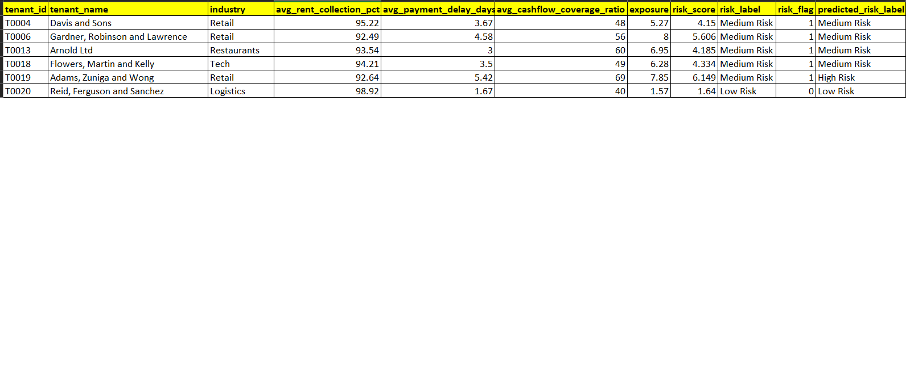
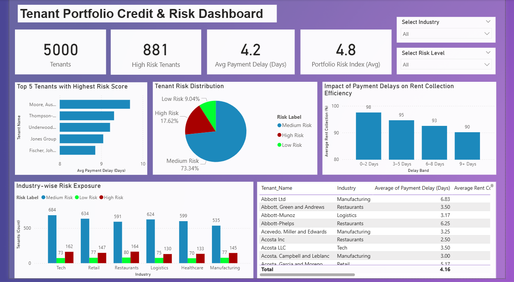

# 🚀 Portfolio Decision Intelligence Engine (Data → Strategy System)

---

## 🔍 Problem

Organizations generate large volumes of financial and operational data, but most systems stop at reporting.

Leadership teams still struggle to answer:
- Which portfolios are truly performing?
- Where is hidden risk building up?
- How should strategy shift based on current signals?

Traditional dashboards provide visibility — but not **decision clarity**.

---

## 💡 Solution

Developed a **Decision Intelligence Engine** that transforms raw financial data into **actionable strategic signals**.

Instead of just reporting metrics, the system evaluates portfolios across multiple dimensions and identifies:
- Growth potential  
- Stability  
- Risk exposure  
- Strategic positioning  

This enables a shift from **data analysis → decision-making**.

---

## 📈 Business Impact

- Converts raw financial data into decision-ready insights  
- Reduces dependency on manual analysis  
- Enables faster and more confident portfolio decisions  
- Demonstrates scalable architecture for enterprise analytics systems  

---

## 🧠 Core Intelligence Layer

The system evaluates portfolios using key signals:

- **Growth** → Revenue / expansion trends  
- **Stability** → Consistency of performance  
- **Risk** → Volatility and exposure  
- **Diversification** → Portfolio concentration  

These signals are combined into a structured framework to guide decision-making.

---

## ⚙️ System Architecture

1. Data ingestion into Snowflake  
2. Data transformation and modeling  
3. Feature engineering (signal creation)  
4. Scoring logic across portfolios  
5. Strategy classification (Growth / Risk / Balanced)  
6. Output layer for decision support  

---

## 🛠️ Tech Stack

- Snowflake (Data Warehouse)  
- Python  
- SQL  
- Data Modeling & Transformation  

---

## 🚀 Key Features

- End-to-end data-to-decision pipeline  
- Multi-signal evaluation framework  
- Strategy classification layer  
- Scalable Snowflake-based architecture  
- Designed for real-world business use cases  

---

## 📸 Sample Output

Real portfolio evaluation output:

## 📊 Interactive Dashboard (Power BI)

To make the decision intelligence system more accessible for business users, an interactive Power BI dashboard has been developed.

This dashboard enables:
- Portfolio-level performance comparison  
- Visualization of growth, risk, and stability signals  
- Strategy classification insights  
- Quick identification of high-risk or high-growth portfolios  

📁 Power BI File:  
[Download Dashboard](./Tenant_Risk_Dashboard_V3.pbix)

### 📸 Dashboard Preview

---

## 🔮 Future Enhancements

- Real-time decision engine  
- AI-driven strategy recommendations  
- Interactive dashboard (Streamlit / BI tools)  
- Scenario simulation (what-if analysis)  

---

## 📌 Positioning Note

This project is designed as a **decision-support system**, not just a data pipeline — with applications in finance, portfolio management, and enterprise strategy.
